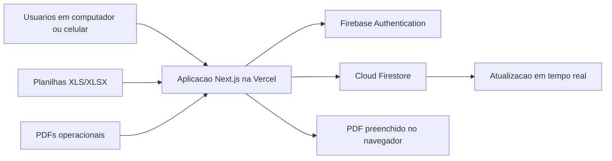

# Fluxo Oficina - briefing tecnico para Tecnologia

## 1. Resumo executivo

O Fluxo Oficina e uma aplicacao web responsiva para coordenar a operacao de pos-venda da concessionaria. O sistema centraliza preparacao da agenda, recepcao, oficina, orcamento complementar, lavagem, entrega, pedidos de pecas, agendamento de retorno, funilaria, pos-servico HGSI e indicadores gerenciais.

O produto substitui controles fragmentados e transforma cada veiculo em um registro operacional compartilhado, com estado atual e historico de movimentacoes.

## 2. Arquitetura implantada

### Camada de apresentacao

- Next.js 16, React 19 e TypeScript.
- Interface responsiva para computador e celular.
- Hospedagem de producao na Vercel.
- Aplicacao acessada por HTTPS no navegador, sem instalacao obrigatoria.

### Identidade e acesso

- Firebase Authentication com e-mail e senha.
- O primeiro cadastro cria um perfil inativo.
- Um administrador ou gerente precisa validar o acesso e definir a funcao.
- A navegacao e direcionada conforme o perfil do usuario.

### Dados

- Cloud Firestore na regiao `southamerica-east1`.
- Modelo NoSQL orientado ao estado operacional do veiculo.
- Realtime Database nao e usado e esta bloqueado para leitura e escrita.
- Atualizacoes de quadros usam listeners em tempo real do Firestore.

### Publicacao e codigo

- Projeto Vercel: `fluxo-oficina-terra-santa`.
- Repositorio GitHub: `cleytonr91/fluxo-oficina-terra-santa`.
- Versao operacional consolidada na branch `main`, commit `46564d2`.
- Diretorio local e repositorio remoto sincronizados em 05/08/2026.
- Verificacoes locais: ESLint, TypeScript e build de producao.

### Avancos de governanca ja concluidos

- Ficha de teste de rodagem, PDF original, ajustes do fluxo, correcoes de pecas, regras do Firebase e documentacao registrados no GitHub.
- Regras permanentes do Realtime Database versionadas e publicadas, bloqueando leitura e escrita no banco que nao e utilizado.
- Arquivos de ambiente e vinculos locais da Vercel permanecem fora do repositorio.
- Ultimo conjunto consolidado aprovado em lint, verificacao TypeScript e build de producao.

## 3. Como a atualizacao em tempo real funciona

As paginas operacionais abrem listeners `onSnapshot` nas colecoes relevantes. Quando um operador altera um chip, o Firestore envia a mudanca aos demais navegadores conectados, sem necessidade de atualizar manualmente a pagina.

Exemplos:

- `vehiclesFlow`: estado atual dos chips.
- `flowEvents`: linha do tempo e auditoria operacional.
- `partOrders`: andamento dos pedidos de pecas.
- `bodyShopProcesses`: acompanhamento da funilaria.

Nao e WebSocket proprio. A sincronizacao e fornecida pelo SDK do Firestore.

## 4. Modelo de dados principal

| Colecao | Responsabilidade |
|---|---|
| `users` | Perfil, funcao e status de acesso |
| `importBatches` | Controle das importacoes realizadas |
| `appointments` | Agendamentos importados e passantes |
| `preparations` | Preparacao confirmada pelo chefe de oficina |
| `vehiclesFlow` | Estado atual de cada veiculo no fluxo |
| `flowEvents` | Historico de movimentos e alteracoes |
| `walkInCustomers` | Clientes passantes |
| `complementaryBudgets` | Orcamentos complementares |
| `partOrders` | Pedidos e disponibilidade de pecas |
| `publicPartLookups` | Consulta publica limitada de pedidos |
| `deliveries` | Informacoes registradas na entrega |
| `postServiceCases` | Tratativas do pos-servico |
| `hgsiRecords` | Registros validos importados da Route |
| `hgsiAnswers` | Respostas das pesquisas HGSI |
| `bodyShopProcesses` | Processos da funilaria |

## 5. Consistencia e rastreabilidade

- Movimentos relevantes atualizam o chip e criam um evento de historico.
- Operacoes relacionadas usam `writeBatch`, garantindo que os documentos do lote sejam gravados juntos ou que nenhum seja gravado.
- Datas de criacao e atualizacao usam `serverTimestamp`, reduzindo dependencia do relogio do aparelho.
- O historico registra etapa, operador, data, hora e observacao operacional.
- A previsao de entrega possui historico proprio, incluindo motivo e responsavel pela alteracao.
- Ha verificacao de duplicidade por placa ou chassi em pontos de entrada do fluxo.

## 6. Perfis atualmente previstos

- Administrador
- Gerente
- Chefe de oficina
- Consultor tecnico
- Mecanico
- Lider de posto
- Consultor de funilaria
- Estoquista
- Coordenador de qualidade
- Agendamento

O acesso visual as paginas e controlado por perfil. As regras do Firestore tambem exigem usuario autenticado, ativo e com funcao autorizada para as colecoes protegidas.

## 7. Importacoes e integracoes atuais

### Syonet

- A agenda e exportada em Excel e importada na pagina de preparacao.
- A leitura ocorre no navegador com SheetJS.
- O sistema extrai cliente, telefone, placa, chassi, modelo, consultor, horario, servico e observacoes disponiveis.

### Route/HGSI

- Arquivo de status de registro identifica registros validos.
- Arquivo de entrevistas alimenta respostas e indicadores.
- O cruzamento prioriza chassi e considera cada O.S. como registro.

### LINX

- O processo de consulta esta mapeado, mas a integracao automatica com o ERP ainda nao esta implantada.

### PDFs

- PDF.js e usado para leitura de documentos.
- pdf-lib e usado para preencher e gerar documentos, como a ficha de teste de rodagem.
- A geracao ocorre no navegador do usuario.

## 8. Seguranca existente

- HTTPS fornecido pela Vercel.
- Login pelo Firebase Authentication.
- Novos cadastros ficam inativos ate aprovacao.
- Regras do Firestore impedem acesso anonimo as colecoes operacionais.
- Realtime Database bloqueado integralmente, pois nao e utilizado.
- A consulta publica de pecas permite buscar um documento especifico, mas nao listar a base.
- Variaveis de configuracao do Firebase ficam no ambiente da Vercel.

Importante: a chave web do Firebase e identificadora do projeto, nao uma credencial administrativa. A protecao efetiva depende do Authentication e das Security Rules.

## 9. Pontos que precisam de endurecimento

Estes itens devem ser apresentados como backlog tecnico, nao como funcionalidades ja concluidas.

### Prioridade alta

1. Tornar as regras do Firestore mais granulares.
   - Hoje algumas colecoes centrais, como `vehiclesFlow` e `flowEvents`, aceitam escrita de varios perfis operacionais.
   - A interface limita as acoes por funcao, mas a regra de banco deve validar tambem quais campos e transicoes cada funcao pode alterar.

2. Implantar ambiente separado de homologacao.
   - Atualmente nao ha evidencia de projeto Firebase e dominio de homologacao separados da producao.
   - Mudancas devem ser validadas em homologacao antes de promover para producao.

3. Formalizar o fluxo de publicacao.
   - A versao atual esta consolidada e sincronizada com o GitHub.
   - O processo futuro ainda deve exigir branch de trabalho, revisao, testes, merge e deploy automatico da Vercel.
   - Publicacao direta do ambiente local deve deixar de ser o procedimento normal.

4. Formalizar backup e restauracao.
   - Confirmar ou habilitar backup agendado/PITR do Firestore.
   - Documentar RPO, RTO e teste periodico de restauracao.

### Prioridade media

5. Criar testes automatizados.
   - Existem lint, verificacao de tipos e build.
   - Ainda nao ha suite de testes unitarios, integrados ou ponta a ponta no projeto.

6. Reforcar controle de concorrencia.
   - Lotes garantem atomicidade entre documentos relacionados.
   - Duas pessoas alterando o mesmo campo quase ao mesmo tempo ainda seguem a regra de ultima gravacao.
   - Transicoes criticas podem usar transacoes e versao do documento.

7. Fortalecer a auditoria.
   - O sistema grava eventos e horario do servidor.
   - O nome exibido do operador ainda e enviado pela aplicacao; para auditoria forte, o UID autenticado deve ser gravado e validado no backend/regra.
   - O historico deve ser imutavel por regra.

8. Implantar observabilidade.
   - Adicionar monitoramento de erros do navegador, alertas e painel de disponibilidade.
   - Acompanhar consumo de leituras, gravacoes e armazenamento do Firestore.

9. Definir politica LGPD.
   - O sistema trata nome, telefone, placa, chassi, avaliacao e assinatura.
   - Definir finalidade, retencao, descarte, perfis autorizados e resposta a incidente.

## 10. Escalabilidade e custos

O Firestore e adequado ao volume atual e escala sem administracao de servidor. O custo e baseado principalmente em leituras, gravacoes, exclusoes, armazenamento e trafego.

Os listeners em tempo real geram leituras quando documentos entram no resultado ou sao alterados. Para o volume atual de uma concessionaria, a arquitetura e simples e adequada. Para crescimento do historico, sera necessario:

- Consultas filtradas por periodo e unidade.
- Paginacao de pedidos, eventos e registros HGSI.
- Politica de arquivamento.
- Monitoramento de consumo e alertas de orcamento.

## 11. Disponibilidade e contingencia operacional

- O sistema depende de internet, Vercel, Firebase Authentication e Firestore.
- O navegador pode manter algum cache tecnico, mas a operacao nao deve ser considerada offline.
- Em indisponibilidade de internet ou Firebase, novas alteracoes podem nao chegar aos demais usuarios.
- A contingencia operacional e o uso temporario de planilha/formulario controlado e posterior reconciliacao.
- O plano formal de continuidade ainda deve ser definido com a area de Tecnologia.

## 12. Perguntas provaveis e respostas curtas

### Existe servidor proprio na concessionaria?

Nao. A aplicacao usa servicos gerenciados: Vercel para a camada web e Firebase para identidade e banco.

### Qual e o banco de dados?

Cloud Firestore, NoSQL, hospedado na regiao de Sao Paulo. O Realtime Database nao e usado e esta bloqueado.

### Como varios operadores veem a mesma alteracao?

Por listeners em tempo real do Firestore. Uma mudanca confirmada no banco e distribuida aos navegadores conectados.

### O que impede qualquer pessoa de criar uma conta e entrar?

O cadastro novo fica inativo. O usuario so acessa as paginas depois de aprovacao administrativa e atribuicao de funcao.

### A autorizacao existe apenas na tela?

Nao. Ha regras no Firestore exigindo autenticacao, usuario ativo e funcao autorizada. Entretanto, a validacao por campo e por transicao ainda deve ser refinada.

### Como sabemos quem movimentou um veiculo?

Cada movimentacao relevante cria um evento com operador, etapa, observacao e horario do servidor. Para auditoria de nivel corporativo, ainda recomendamos vincular cada evento de forma imutavel ao UID autenticado.

### Pode haver perda quando duas pessoas alteram ao mesmo tempo?

Os lotes evitam gravacao parcial. Em alteracoes concorrentes do mesmo campo, atualmente prevalece a ultima gravacao; transacoes com controle de versao sao uma evolucao recomendada para etapas criticas.

### Ha backup?

O Firestore possui infraestrutura gerenciada, mas backup operacional e restauracao precisam ser formalmente configurados e testados no projeto. Nao deve ser prometido RPO/RTO sem essa verificacao.

### Os dados ficam no Brasil?

O banco foi configurado em `southamerica-east1`, Sao Paulo. A equipe de Tecnologia deve validar os demais fluxos de processamento, logs e requisitos corporativos de residencia de dados.

### A API key do Firebase estar no navegador e uma falha?

Nao por si so. Em aplicativos web Firebase, essa configuracao identifica o projeto. O controle de acesso e feito pelo login e pelas regras do banco. Credenciais administrativas nao devem estar no navegador.

### O sistema integra diretamente com LINX, Syonet e Route?

Ainda nao. Syonet e Route usam importacao de arquivos. O caminho do LINX esta mapeado, mas a automacao depende de validacao tecnica, credenciais, disponibilidade de API e autorizacao dos fornecedores.

### Como e feita uma nova versao?

A versao operacional atual esta consolidada na `main` do GitHub e a aplicacao esta hospedada na Vercel. O proximo passo de governanca e formalizar o processo futuro com branch de trabalho, revisao, testes, homologacao, merge e deploy automatico em producao.

## 13. Mensagem recomendada para a reuniao

O sistema ja valida o processo operacional, demonstra ganho de visibilidade em tempo real e agora possui a versao operacional consolidada no GitHub. A proxima fase nao e refazer o produto, mas profissionalizar sua governanca tecnica: homologacao, publicacao automatizada, regras de menor privilegio, backup, testes e monitoramento. A participacao da Tecnologia e importante justamente para transformar uma solucao operacional validada em uma plataforma corporativa sustentavel.
