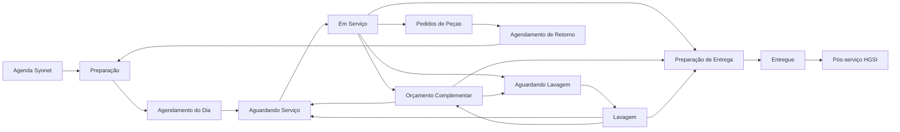

# Lógica do Sistema - Fluxo Oficina Terra Santa

Este documento descreve o funcionamento operacional do sistema oficial, as regras aplicadas em cada etapa e a relação entre os módulos. Ele deve ser atualizado sempre que uma regra de negócio for alterada.

> **Fonte de verdade:** este documento registra o comportamento implementado no código em 1º de agosto de 2026. Quando houver divergência entre uma ideia antiga e o sistema publicado, prevalece a regra descrita aqui e validada no código.

## 1. Objetivo do sistema

O sistema acompanha a jornada completa do veículo na operação de pós-vendas:

1. Importação e preparação da agenda.
2. Recebimento do veículo.
3. Execução na oficina.
4. Orçamento complementar, quando necessário.
5. Lavagem.
6. Preparação e registro da entrega.
7. Pedido e acompanhamento de peças.
8. Agendamento do retorno quando a peça estiver disponível.
9. Tratativa de pós-serviço e acompanhamento HGSI.
10. Acompanhamento gerencial da operação.
11. Controle dos processos de funilaria.

O veículo é representado por um único chip operacional. Os outros módulos espelham informações desse chip ou criam registros relacionados, sem criar um segundo fluxo para o mesmo atendimento.



## 2. Tecnologia, dados e atualização

- **Interface:** Next.js e React.
- **Autenticação:** Firebase Authentication.
- **Banco oficial:** Firebase Firestore.
- **Publicação:** Vercel.
- **Importações:** arquivos Excel `.xls`/`.xlsx` e, no recebimento Mobis, PDF.
- **Atualização em tempo real:** os módulos de fluxo, peças e funilaria acompanham alterações do Firestore. Uma movimentação salva por um operador deve aparecer para os demais sem recarregar manualmente a página.
- **Auditoria:** as mudanças importantes registram operador, data, hora, etapa anterior, nova etapa e observação quando aplicável.

### 2.1 Coleções principais

| Coleção | Finalidade |
|---|---|
| `users` | Usuários, função e situação do acesso |
| `importBatches` | Histórico dos arquivos importados |
| `appointments` | Agendamentos |
| `preparations` | Decisões da preparação |
| `vehiclesFlow` | Estado atual de cada chip |
| `walkInCustomers` | Passantes |
| `flowEvents` | Histórico de movimentações |
| `complementaryBudgets` | Orçamentos complementares |
| `partOrders` | Pedidos de peças |
| `publicPartLookups` | Consulta pública do portal Minha Peça |
| `deliveries` | Registros de entrega |
| `postServiceCases` | Tratativas de pós-serviço |
| `hgsiRecords` | Status de registro Route |
| `hgsiAnswers` | Respostas das pesquisas HGSI |
| `bodyShopProcesses` | Processos de funilaria |

## 3. Acesso e segurança

### 3.1 Primeiro acesso

1. O usuário informa nome, e-mail, senha e função pretendida.
2. A conta é criada como **inativa**.
3. Enquanto estiver inativa, o usuário vê apenas a mensagem de acesso aguardando aprovação.
4. Administrador ou gerente confere a pessoa, ajusta a função e ativa o acesso.
5. Depois da ativação, o sistema direciona o usuário para a primeira página permitida para sua função.

Não existe acesso operacional automático após o cadastro.

### 3.2 Permissões por função

| Função | Páginas permitidas |
|---|---|
| Administrador | Todas |
| Gerente | Todas |
| Chefe de oficina | Preparação, Peças e Fluxo |
| Consultor técnico | Fluxo, Balcão e Pós-serviço |
| Mecânico | Fluxo |
| Líder de posto | Fluxo |
| Consultor de funilaria | Peças, Balcão, Funilaria e Fluxo |
| Estoquista | Peças, Balcão, Fluxo e Funilaria |
| Coordenador de qualidade | Pós-serviço |
| Agendamento | Agendamento |

As permissões de tela são acompanhadas por regras no Firestore. A pessoa não deve conseguir acessar dados apenas digitando o endereço de uma página proibida.

### 3.3 Ações administrativas especiais

- Administrador e gerente podem alterar o consultor responsável pelo chip.
- Administrador e gerente podem excluir logicamente um chip, mantendo registro de auditoria.
- Administrador, gerente e o acesso administrativo principal podem reduzir uma previsão de entrega. Para os demais usuários, a previsão só pode ser mantida ou aumentada.

## 4. Regras compartilhadas

### 4.1 Identificação do veículo

A ordem de confiança é:

1. **Chassi normalizado:** identificador mais confiável.
2. **Placa normalizada:** utilizada quando o chassi não estiver disponível.
3. **O.S. ou identificador do atendimento:** apoio em importações de pós-serviço.

Espaços, pontuações e diferenças entre maiúsculas e minúsculas são removidos para comparações.

### 4.2 Duplicidade

- Antes de criar ou confirmar um chip, o sistema procura outro fluxo ativo com a mesma placa ou chassi.
- Um veículo entregue não bloqueia um novo atendimento futuro.
- Na preparação, duplicidades dentro do próprio arquivo também são destacadas.
- Havendo conflito real, o operador recebe um alerta com o chip encontrado antes de confirmar uma substituição.

### 4.3 Datas e permanência no fluxo

- A data escolhida na tela define a visão operacional do dia.
- Veículos entregues aparecem no quadro **Entregue** somente na data em que foram entregues.
- Veículos não concluídos podem continuar no dia seguinte quando estiverem em:
  - Aguardando Serviço;
  - Em Serviço;
  - Aguardando Lavagem;
  - Lavagem.
- Preparação de Entrega não é pendência de produção do técnico.
- Chips antigos que nunca saíram do Agendamento do Dia não entram automaticamente como produção do dia seguinte; eles seguem a regra de no-show.

### 4.4 Histórico e horário fora do expediente

- Cada movimentação registra o operador e o momento da ação no banco para auditoria e consistência técnica.
- Na apresentação operacional, ações feitas após as 18h podem ocultar o horário e mostrar apenas o operador ou a indicação de ação fora do expediente.
- Atualizações de previsão aparecem na mesma linha do tempo das mudanças de etapa.
- Marcações automáticas repetitivas de no-show são filtradas da visualização do histórico.

### 4.5 WhatsApp

Quando existe telefone válido, clicar no nome do cliente abre o WhatsApp Web com uma abordagem adequada ao contexto. No celular, o atalho pode ser ocultado para reduzir a poluição visual.

## 5. Preparação do Dia Seguinte

### 5.1 Entrada da agenda

1. O chefe de oficina escolhe um arquivo Excel 97/2003 ou atual (`.xls` ou `.xlsx`).
2. O sistema lê cliente, consultor, veículo, placa, chassi, telefone, data, hora, tipo de serviço e observações.
3. O sistema identifica a data presente no arquivo.
4. O chefe confirma a data que será preparada. É permitido trabalhar um ou mais dias à frente.
5. O arquivo e a data confirmada ficam registrados como lote de importação.

### 5.2 Conferência automática

- Detecta chassis repetidos no arquivo e no dia selecionado.
- Permite preencher placa ausente.
- Sugere teste de rodagem quando encontra termos ligados a diagnóstico, ruído, freio, suspensão, vibração, falha ou comportamento dinâmico.
- Sugere prioridade alta para diagnóstico, retorno ou cliente que aguarda.
- A observação original da agenda é mantida em destaque.

### 5.3 Decisões do chefe de oficina

Para cada veículo, o chefe define:

- Técnico responsável.
- Prioridade: **Normal** ou **Alta**.
- Necessidade de teste de rodagem.
- Necessidade de o chefe ouvir o relato do cliente.
- Observação interna da oficina.

O técnico é obrigatório para confirmar a preparação. As opções atuais incluem Wesley, Ayslan, Gilvan, Elimarcos, Hernando, Nathan e Igo.

### 5.4 Confirmação

Ao clicar em **Confirmar preparação**:

1. A duplicidade ativa é verificada novamente.
2. O agendamento e a preparação são gravados.
3. O chip é criado diretamente em **Agendamento do Dia**, na data escolhida.
4. Um evento de histórico é criado.

Não é necessário um segundo comando de “salvar preparação” para o chip migrar.

### 5.5 Planejamento por técnico

Os quadros estratégicos por técnico combinam:

- Agendamentos já direcionados para a data escolhida.
- Pendências anteriores em Aguardando Serviço ou Em Serviço.
- Veículos imobilizados cujas peças ficaram disponíveis.

O objetivo é mostrar a carga real antes de distribuir novos veículos.

## 6. Fluxo da Oficina

### 6.1 Etapas principais

| Etapa | Responsável principal | Regra de saída |
|---|---|---|
| Agendamento do Dia | Consultor | Confirmar recebimento |
| Aguardando Serviço | Técnico/chefe | Iniciar serviço ou antecipar lavagem |
| Em Serviço | Técnico | Concluir para orçamento, lavagem ou entrega |
| Orçamento Complementar | Técnico/peças/consultor | Registrar orçamento e autorização |
| Aguardando Lavagem | Líder de posto | Iniciar lavagem |
| Lavagem | Líder de posto | Concluir e seguir conforme origem |
| Preparação de Entrega | Consultor | Registrar entrega |
| Entregue | Consultor | Alimenta o pós-serviço |

### 6.2 Agendamento do Dia para atendimento

Ao mover o chip, o consultor deve informar:

- Consultor que realmente recebeu o cliente.
- Se o cliente aguardará na loja.
- Data e hora prometidas para entrega.
- Tipo de lavagem:
  - Lavagem simples;
  - Lavagem de motor;
  - Lavagem de motor + bancos;
  - Não.
- Observação do recebimento.
- Se o teste de rodagem foi realizado, quando a preparação o exigiu.

Regras:

- A previsão de entrega é obrigatória.
- A resposta sobre o teste é obrigatória quando ele foi solicitado.
- Serviço exclusivamente de lavagem segue diretamente para **Aguardando Lavagem**.
- Os demais seguem para **Aguardando Serviço**.
- O consultor do agendamento pode ser corrigido nesse momento, pois o Syonet pode trazer um responsável diferente de quem realmente recebeu.

### 6.3 No-show

Um veículo vira no-show somente quando:

- Continua em **Agendamento do Dia**.
- Passou mais de uma hora do horário agendado.
- Não existe evidência de recebimento ou movimentação operacional.

Consequências:

- Sai da contagem do Fluxo do Dia.
- Permanece visível na área de no-show.
- Pode gerar relatório em PDF.

Quando o cliente chega atrasado:

1. O operador move o no-show diretamente para **Aguardando Serviço**.
2. O sistema apresenta o mesmo questionário normal de recebimento.
3. O horário do agendamento é atualizado para o momento do retorno, evitando que o chip volte imediatamente a ser marcado como no-show.
4. A marca de no-show é removida.

### 6.4 Aguardando Serviço

- O técnico designado é obrigatório para iniciar o trabalho.
- A previsão de entrega precisa existir.
- O sistema confirma cliente aguardando e permite observação.
- Se houver lavagem ainda pendente, existe a ação **Lavagem antecipada**.
- A ordenação inteligente continua automática: cliente aguardando, menor prazo prometido, prioridade alta e organização por consultor influenciam a posição.

### 6.5 Em Serviço

Ao concluir a atuação da oficina, o técnico escolhe:

- **Orçamento Complementar**; ou
- **Aguardando Lavagem**, se existe lavagem pendente; ou
- **Preparação de Entrega**, se não existe lavagem ou se ela já foi concluída antecipadamente.

Se o técnico indicar necessidade de pedido de peça:

- O flag de pedido fica ativo no chip.
- O pedido aparece no módulo de Peças.
- Na entrega, o consultor recebe o aviso; ele não responde novamente se houve pedido.

### 6.6 Lavagem antecipada

A lavagem pode acontecer antes do serviço para adiantar a operação.

1. A partir de Aguardando Serviço, a ação **Lavagem antecipada** leva o chip diretamente para Lavagem, sem passar por Aguardando Lavagem.
2. O líder conclui a lavagem.
3. Se o serviço ainda não foi executado, o chip retorna para Aguardando Serviço.
4. Depois da oficina, ele pula a lavagem e segue para Preparação de Entrega.

Se a lavagem foi antecipada durante um orçamento complementar realizado, o chip também vai diretamente para Lavagem e retorna para o mesmo orçamento após a conclusão.

### 6.7 Orçamento Complementar

O quadro é dividido em **Aguardando** e **Orçamento Realizado**.

Para concluir a elaboração, é obrigatório registrar:

- Quem realizou o orçamento.
- Disponibilidade das peças: Sim, Não ou Parcial.
- Observação de peças.

Depois, o consultor informa se o orçamento foi autorizado:

- **Sim:** exige nova previsão de entrega e retorna para Aguardando Serviço. O chip recebe a indicação de orçamento autorizado.
- **Não:** segue para Aguardando Lavagem quando existe lavagem pendente; caso contrário, segue para Preparação de Entrega.

A nova previsão não pode ser menor que a anterior, exceto para os acessos administrativos autorizados. Toda alteração exige motivo.

### 6.8 Lavagem

- Aguardando Lavagem vai para Lavagem quando o líder inicia a operação.
- Ao concluir:
  - volta para Aguardando Serviço se foi antecipada antes da oficina;
  - volta para Orçamento Complementar se foi antecipada durante o orçamento;
  - segue para Preparação de Entrega se o serviço já terminou ou se era um serviço somente de lavagem.

O detalhe do chip mostra o tipo de lavagem e o status: não solicitada, pendente, em andamento ou concluída.

### 6.9 Preparação de Entrega e Entregue

O formulário de entrega exige respostas sem valor pré-selecionado:

- Veículo entregue no prazo combinado: Sim ou Não.
- Cliente saiu com alguma pendência: Sim ou Não.
- Se existe pendência, a observação é obrigatória.
- NPS interno de 1 a 10, sem sugestão automática.

Faixas visuais do NPS interno:

- 1 a 6: vermelho.
- 7 a 8: amarelo.
- 9 a 10: verde.

O pedido de peças é apresentado automaticamente quando existir. Ao registrar a entrega, o chip entra em Entregue com a data real e passa a alimentar o Pós-serviço.

### 6.10 Passantes

O cadastro de passante exige os dados do cliente, veículo, serviço e previsão de entrega.

- A duplicidade por placa/chassi é verificada.
- Se o serviço for exclusivamente lavagem ou embelezamento, o tipo de lavagem é obrigatório e o chip entra em Aguardando Lavagem.
- Nos demais casos, entra em Aguardando Serviço.
- O chefe de oficina pode posteriormente ajustar o técnico pelo detalhe do chip.

### 6.11 Correções pelo detalhe do chip

O detalhe permite, conforme a permissão:

- Adicionar ou corrigir placa.
- Trocar técnico.
- Trocar tipo de serviço.
- Alterar tipo de lavagem.
- Alterar consultor, para admin e gerente.
- Corrigir etapa, sempre com motivo.
- Criar pedido com uma ou mais peças.
- Alterar previsão, sempre com justificativa.
- Excluir logicamente o chip, para admin e gerente.

Correções preservam o histórico; não apagam silenciosamente o que aconteceu.

### 6.12 Ficha de Teste de Rodagem

No detalhe do chip existe uma ficha digital baseada no formulário operacional da oficina. Cliente, placa, modelo e chassi são preenchidos automaticamente com os dados do atendimento. O número da O.S. permanece editável.

A ficha é dividida em quatro etapas:

1. Teste na recepção com o cliente.
2. Teste interno para direcionamento ao técnico.
3. Controle de qualidade e verificação da eficácia da intervenção.
4. Teste de saída com o cliente.

Cada etapa pode registrar data, quilometragem de saída e chegada, horários, duas impressões do teste e responsável. Nas etapas com o cliente, também é possível confirmar o acompanhamento e coletar a assinatura diretamente na tela do celular.

- O preenchimento pode ser salvo parcialmente e retomado por outro operador.
- Cada salvamento gera um evento de auditoria no histórico do chip.
- A assinatura eletrônica simples fica vinculada à ficha e ao atendimento.
- O botão **Exportar PDF** salva os dados atuais e preenche o layout original da ficha impressa em uma única página A4, mantendo títulos, divisões e identidade visual do documento fornecido.
- A assinatura é operacional e presencial; não equivale a uma assinatura digital certificada pela ICP-Brasil.

## 7. Indicadores do Fluxo do Dia

### 7.1 Total fixo

O **Fluxo do Dia** não diminui quando o veículo vai para Preparação de Entrega ou Entregue.

```text
Fluxo do Dia = Agendados do dia
              + Passantes recebidos no dia
              + Remanescentes de dias anteriores
              - No-show do dia
```

Imobilizados são apresentados separadamente e não entram nesse total.

### 7.2 Origem do fluxo

- **Agendados:** veículos agendados para a data, excluindo no-show ativo.
- **Passantes:** cadastros sem agendamento feitos na data.
- **Dias anteriores:** veículos antigos ainda em Aguardando Serviço, Em Serviço, Aguardando Lavagem ou Lavagem.

### 7.3 Tipo de serviço

Os veículos do Fluxo do Dia são classificados como:

- Revisões.
- Diagnósticos.
- Reparos gerais.
- Embelezamento.

Embelezamento conta apenas serviços puramente de lavagem/estética. Quando o atendimento também possui revisão, diagnóstico ou reparo, prevalece o serviço de oficina.

### 7.4 Outros indicadores

- **No-show:** lista operacional de ausências.
- **Em atenção:** prioridade alta, teste de rodagem, cliente aguardando, orçamento pendente ou previsão atrasada.
- **Imobilizados:** veículos marcados como imobilizados no pedido de peças.
- **Concluídos do dia:** veículos que entraram em Preparação de Entrega ou Entregue na data selecionada.

Os filtros de consultor, técnico e placa combinam entre si.

## 8. Pedidos de Peças

### 8.1 Criação

O técnico, chefe de oficina ou outro perfil autorizado pode indicar a necessidade de peças pelo chip. O pedido contém:

- Placa e vínculo com o veículo.
- ID do cliente, que pode ser preenchido depois.
- Uma ou mais referências e descrições.
- Veículo imobilizado: Sim ou Não.
- Tipo: Garantia ou Externo.

O status inicial é **Solicitado oficina**.

### 8.2 Status e exigências

| Status | Exigência |
|---|---|
| Solicitado oficina | Estado inicial |
| Pedido realizado | Origem e número do pedido |
| B.O. - Back Order | Origem e número do pedido |
| Em trânsito | Nota fiscal e previsão de chegada |
| Recebido | Confirmação do recebimento |
| Disponível | Peça liberada para uso/agendamento |
| Cancelado | Motivo obrigatório |

Origens disponíveis: Mobis, Natal, Mossoró, Juazeiro e Rede Autorizada. O pedido também pode ser marcado como VOR e filtrado separadamente.

### 8.3 Pendências do setor de peças

Conta como pendência:

- Pedido ainda em Solicitado oficina; ou
- Pedido que recebeu previsão de chegada, mas ainda não foi movido para Disponível ou Cancelado.

O objetivo do painel é deixar visível o que exige ação e reduzir rapidamente a fila até Disponível.

### 8.4 Veículos disponíveis

- **Não imobilizado:** aparece em Veículos disponíveis para agendamento.
- **Imobilizado:** recebe prioridade máxima e aparece na preparação para o chefe de oficina programar a execução, sem depender do setor de agendamento.

O chip imobilizado possui atalho para o pedido de peças relacionado.

### 8.5 Importação do recebimento Mobis

Ao importar o PDF entregue com a nota fiscal:

1. O sistema lê nota fiscal, referência e quantidade.
2. Procura pedidos abertos com a mesma referência.
3. Distribui a quantidade recebida do pedido mais antigo para o mais novo.
4. Separa o resultado em encontrados com segurança, encontrados com dúvida e não encontrados.
5. O operador confere antes de aplicar.
6. A confirmação move os pedidos correspondentes para Disponível e registra origem/nota.

Quantidades excedentes permanecem como saldo não associado.

### 8.6 Portal Minha Peça

Pedidos com placa e ID do cliente podem ser sincronizados para consulta pública. O cliente consulta usando apenas esses dois dados e vê:

- Referência e descrição.
- Status.
- Previsão de chegada.
- Disponibilidade para solicitar agendamento.

A base inteira não é exposta e a listagem pública de documentos é bloqueada.

## 9. Agendamento de Retorno

### 9.1 Fila principal

A fila padrão mostra pedidos:

- Com status Disponível.
- Sem veículo imobilizado.
- Ainda não encerrados no agendamento.

O operador também pode pesquisar qualquer pedido por nome, placa, ID do cliente, chassi, telefone, modelo, referência ou descrição para responder ao cliente.

### 9.2 Decisões

Ao clicar em **Agendar**, o operador escolhe:

1. **Agendamento confirmado:** data e hora do retorno obrigatórias.
2. **Contato sem sucesso:** observação e data/hora da tentativa obrigatórias; o sistema sugere o momento atual, que pode ser alterado.
3. **Cliente sem disponibilidade:** observação obrigatória.

Nos dois últimos casos pode ser criado um novo compromisso de contato. Quando a data chega, ele volta a ser uma pendência operacional.

Cada tentativa registra operador, data, decisão e observação.

## 10. Pós-serviço e Funil HGSI

### 10.1 Fontes

O módulo cruza três origens:

- Veículos entregues pelo fluxo.
- Planilha Route de Status de Registro.
- Planilha de respostas HGSI.

O cruzamento prioriza chassi e utiliza O.S. como apoio. Duplicidades são consolidadas por identificador normalizado.

### 10.2 Registro válido

- Apenas linhas identificadas como **Registro válido** entram na base apta.
- Se o mesmo chassi aparecer duas ou três vezes e ao menos um registro for válido, o cliente é considerado válido.
- A contagem exibida considera registros válidos únicos, não todas as linhas da planilha.

### 10.3 Funil

1. **Veículos entregues:** origem do acompanhamento interno.
2. **Aptos HGSI:** registro válido, sem resposta e sem tratativa concluída.
3. **Clientes que responderam:** respostas importadas da montadora.
4. **Clientes tratados:** tratativas concluídas, com identificação de quem tratou.

Quando uma tratativa é concluída, o cliente sai da lista de pendências e aparece apenas em Clientes Tratados, sem duplicação.

### 10.4 Necessidade de tratativa

O cliente é tratado como pendência quando ocorrer pelo menos uma destas situações:

- Pedido de peças.
- Pendência explicitamente informada na entrega.
- NPS interno menor que 8.

Uma observação isolada não transforma automaticamente o caso em pendência.

A tratativa pode registrar responsável, observação, necessidade de GPV e decisão sobre solicitação da pesquisa.

### 10.5 Respostas sem autorização

Respostas com status **Realizada sem autorização**:

- Não entram na base de pesquisas válidas.
- Não contam na meta de 15 pesquisas.
- Não entram nas médias dos consultores.
- São contabilizadas separadamente no campo “Sem autorização”.

### 10.6 Indicadores por consultor

- Meta: 15 pesquisas válidas por consultor.
- Índice HGSI: escala de 0 a 1000.
- Faixas: 950+, 800 a 949 e abaixo de 800.
- Red Flag: resposta negativa à pergunta Q1.3, recomendação da concessionária.
- Recomendação da concessionária: percentual de respostas positivas entre as respostas válidas para essa pergunta.
- Demais indicadores: média em escala de 0 a 10.

Indicadores detalhados:

- Serviço correto.
- Instalações.
- Consultor.
- Prazos.
- Qualidade dos serviços.
- Alinhamento de preços.
- Lavagem.

O número entre parênteses mostra quantas respostas válidas formaram aquela média. Ele pode variar porque nem todos os clientes respondem todas as perguntas.

## 11. Funilaria

### 11.1 Cadastro inicial

O processo pode registrar:

- O.S. e data de entrada.
- Código do cliente.
- Cliente, placa, modelo, ano e cor.
- Número do sinistro.
- Seguradora.
- Status.
- Veículo imobilizado.
- Local: Loja ou Prestador.
- Observação.

Seguradoras disponíveis: Bradesco, Azul, Mapfre, Yelum, Porto, Tokio, Sura, Zurich, HDI, Caixa, Youse, Allianz e Itaú.

### 11.2 Organização visual

- **Aguardando Serviço:** Aguardando Aprovação, Aprovado, Peças Pendentes e Complemento.
- **Em Serviço:** processos em execução.
- **Burocracia:** Finalizado, Aguardando Pagamento e Pago.

Ao finalizar, o processo sai da visão produtiva e permanece na área burocrática.

### 11.3 Complementos do processo

- **Financeiro:** valor total, franquia, faturamento, envio de NF, data de pagamento, mês de recebimento e valor pago.
- **Peças:** observação e indicação de peças pendentes.
- **Documentos:** links para aprovação da seguradora, notas fiscais e comprovantes.
- **Enviar para oficina:** cria ou reutiliza um chip em Agendamento do Dia, como serviço de funilaria, sem duplicar o processo.

Veículo imobilizado enviado pela funilaria recebe prioridade alta.

## 12. Farol Gerencial

O Farol reúne duas camadas.

### 12.1 Operação em tempo real

Utiliza os chips do Firestore para mostrar:

- Recebidos.
- Entregues.
- No-show.
- Orçamentos complementares.
- Pedidos de peças.
- Percentual entregue no prazo.

### 12.2 Resultado financeiro

Apresenta:

- Oficina produtiva: meta, realizado, falta/sobra, média diária, projeção e percentual atingido.
- Embelezamento: os mesmos indicadores.
- Comparação com ano anterior.
- Faturamento por canal.
- Faturamento de peças, serviços e total.
- Lucro bruto, planejado, realizado e margem bruta.
- Quantidade de revisões e TKM.

Fórmulas principais:

```text
Média diária = Realizado / Dias úteis passados
Projeção = Média diária x Total de dias úteis
% atingido = Realizado / Meta
TKM serviços = Faturamento de serviços / Quantidade de revisões
TKM adicionais = Serviços adicionais / Quantidade de revisões
TKM estética = Embelezamento / Quantidade de revisões
```

**Situação atual importante:** os indicadores operacionais vêm do banco em tempo real. Parte da série financeira e das metas ainda está configurada no código a partir das bases fornecidas e não é coletada automaticamente do Linx. Novos períodos exigem importação ou atualização da integração.

## 13. Alertas visuais e prioridade

- Cliente aguardando ocupa posição de maior atenção e recebe símbolo visual no espaço da placa.
- A barra de previsão muda conforme o prazo: normal, atenção e atraso.
- Prioridade alta, teste, orçamento pendente e atraso alimentam “Em atenção”.
- Pedido indisponível/disponível possui sinalização própria.
- Veículo de dia anterior recebe indicador específico.
- Cada coluna do fluxo possui cor própria para facilitar a navegação no celular.

## 14. Regras de integridade

1. Não criar dois chips ativos para a mesma placa ou chassi sem confirmação explícita.
2. Não apagar histórico ao corrigir etapa, responsável ou previsão.
3. Não reduzir previsão de entrega para ganhar prioridade, salvo correção por acesso administrativo.
4. Não concluir entrega sem respostas obrigatórias.
5. Não mover pedido para Pedido Realizado/B.O. sem origem e número.
6. Não mover pedido para Em Trânsito sem nota fiscal e previsão.
7. Não cancelar pedido sem motivo.
8. Não contar resposta sem autorização na meta HGSI.
9. Não classificar como no-show um veículo que já teve movimentação de atendimento.
10. Não incluir imobilizado na fila comum de agendamento.

## 15. Responsabilidade de manutenção

Toda nova regra deve seguir esta sequência:

1. Definir o responsável pela ação.
2. Definir de qual etapa o chip sai e para onde vai.
3. Definir campos obrigatórios.
4. Definir impacto em indicadores.
5. Definir registro de auditoria.
6. Definir comportamento no celular.
7. Atualizar este documento junto com o código.

## 16. Balcão de Peças

O Balcão é um módulo comercial autenticado do Fluxo, separado do acompanhamento de pedidos originados na oficina.

### 16.1 Lançamentos

- Tipos: Venda, Pedido e Venda Perdida.
- Cliente classificado como PF ou PJ.
- Vendedor responsável selecionado entre Alisson e Felipe, frete e observações.
- Venda exige estado de destino e considera todos os itens disponíveis em estoque.
- Pedido exige estado de destino e permite indicar, por item, disponibilidade em estoque ou origem: Mobis, Rede, Natal, Mossoró ou Juazeiro.
- Todos os textos digitados são armazenados em caixa alta.

### 16.2 Catálogo Hyundai

- A referência pesquisa o catálogo importado no Firestore.
- Ao selecionar uma sugestão, descrição e preço de venda são preenchidos automaticamente.
- O valor usado no Balcão é sempre o preço de venda.

### 16.3 Acompanhamento de pedidos

- Cada item possui status, origem, nota fiscal, previsão de chegada e observação.
- Um pedido pode ser transformado em Venda ou Venda Perdida.
- Ao virar venda, seus itens passam a ser considerados disponíveis.

### 16.4 Indicadores

- Vendas realizadas, vendas perdidas e expectativa do mês.
- Representação de vendas para PF e PJ.
- Comparação dos seis meses mais recentes.
- Resultado por vendedor e por estado de destino.
- Meta mensal cadastrada no Firestore.
